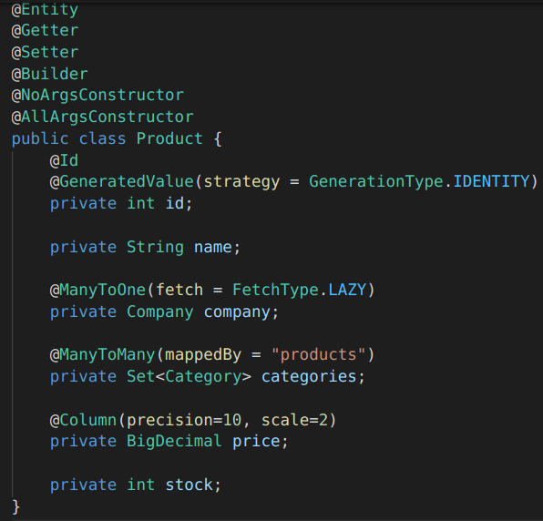
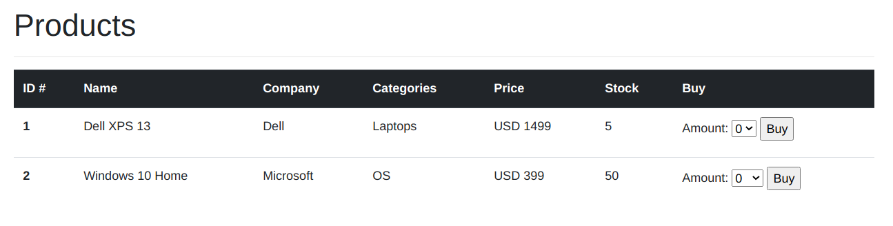
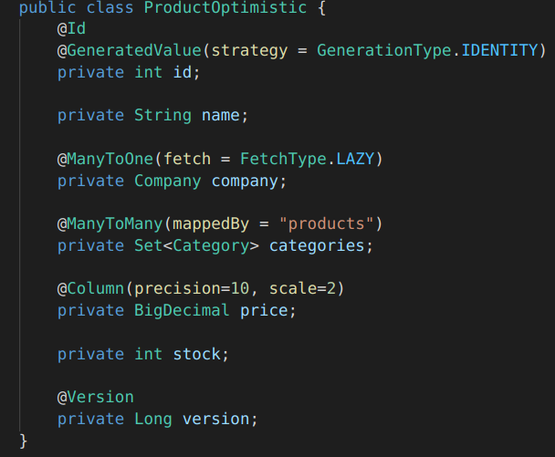
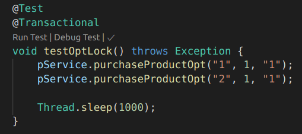
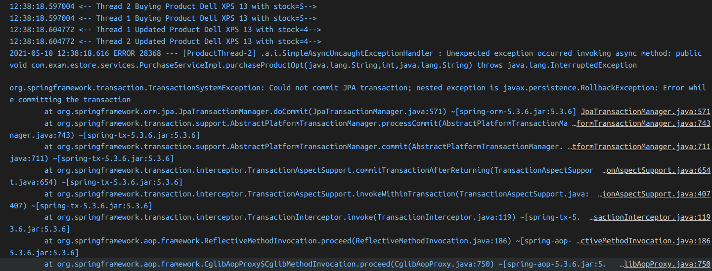
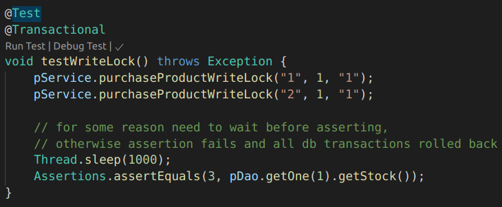
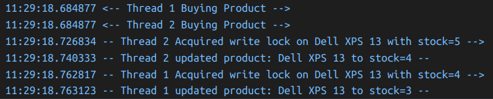

# Software Architecture Design 2021 - Final Exam

## 10th May 2021 - Htoo Lwin (120832)

## Important notes

1. **Note: All test cases do not test through the web part of the app or through the controllers**
1. **Note: The webpage DOES NOT use any form of locking. The locking are only tested in the unit tests.**
1. **Note: For some reason I need to pause the main test thread to wait for the two transactions. Otherwise, an exception is thrown saying the DB is already closed. That's why I have `Thread.sleep(1000)` in both optimistic and pessimistic locking test cases.**

## Product Model

The price is stored as `BigDecimal` in DB while in Java is stored as `MonetaryAmount`. The `Company` entity has a `ManyToOne` relationship with `Product` and the `Category` entity has a `ManyTOMany` relationship.

***

## Buy Page

The buy page is currently working and we can select amount to buy from dropdown based on remaining stock.

***

### Note: All test cases do not test through the web part of the app or through the controllers

## Optimistic Locking and Testing

Optimistic locking is implemented via the `@Version` annotation in the model and in the database. I made a separate model called `ProductOptimistic` for testing while the original `Product` is used for Pessimistic Locking. (see below in Pessimistic Locking section).

**Note: The webpage DOES NOT use any form of locking. The locking are only tested in the unit tests.**

The unit test for the optimistic locking is shown below.

The result from the above test case is shown below. The app does throw an error when thread 2 tries to purchase the product since the version is out of date when thread 2 tries to update **although the exception itself is not the** `StaleObjectStateException`. I am not sure why this is the case and hence I don't know what exception to assert for too.

**Note: For some reason I need to pause the main test thread to wait for the two transactions. Otherwise, an exception is thrown saying the DB is already closed. That's why I have `Thread.sleep(1000)` in both optimistic and pessimistic locking test cases.**

***

## Pessimistic Locking and Testing

Pessimistic locking is implemented via the `@Lock(LockModeType.PESSIMISTIC_WRITE)` annotation in the DAOs for each query. The test case is shown below.

The results of the test case is shown below. Thread 1 only purchases the product after thread 2 is done purchasing while they both start at the same time. Similarly, I have to put a sleep before the assertion otherwise an exception is thrown.

